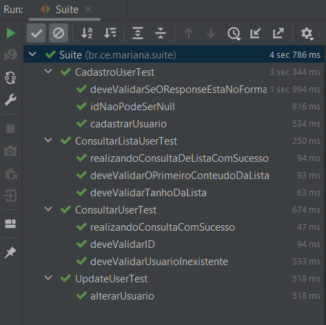

# Automação API Datum

## Como executar o projeto

* Importante ter o Java instalado ( Versão 11 ou superior)
* Importante ter o Maven instalado ( Versão 3.6.0 ou superior)

Execute a Classe Suite para executar todos os cenários, conforme imagem abaixo

Dentro da pasta test, contém todos os testes que foram feitos, conforme imagem abaixo

Todos os testes executados com sucesso

